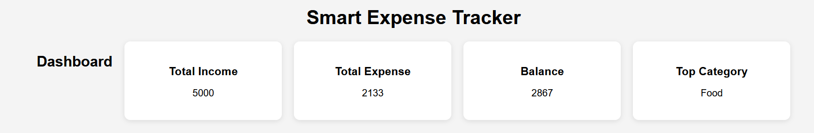
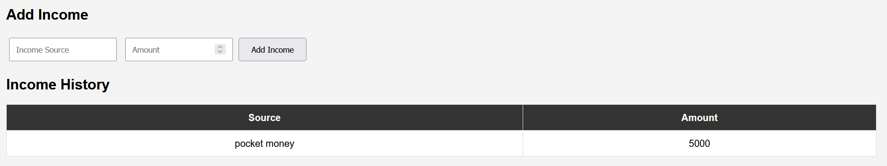
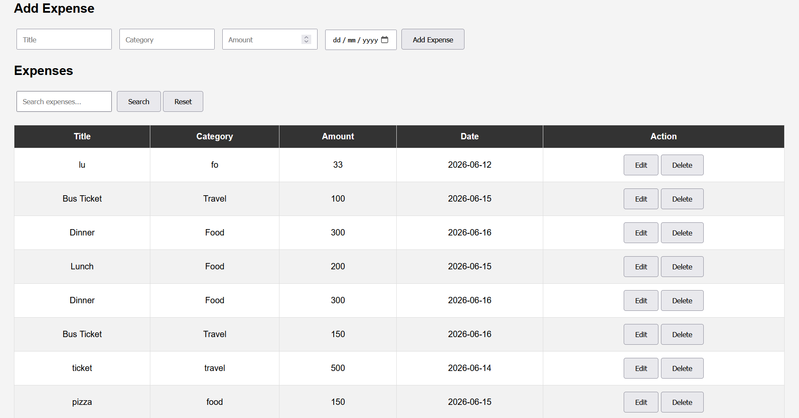
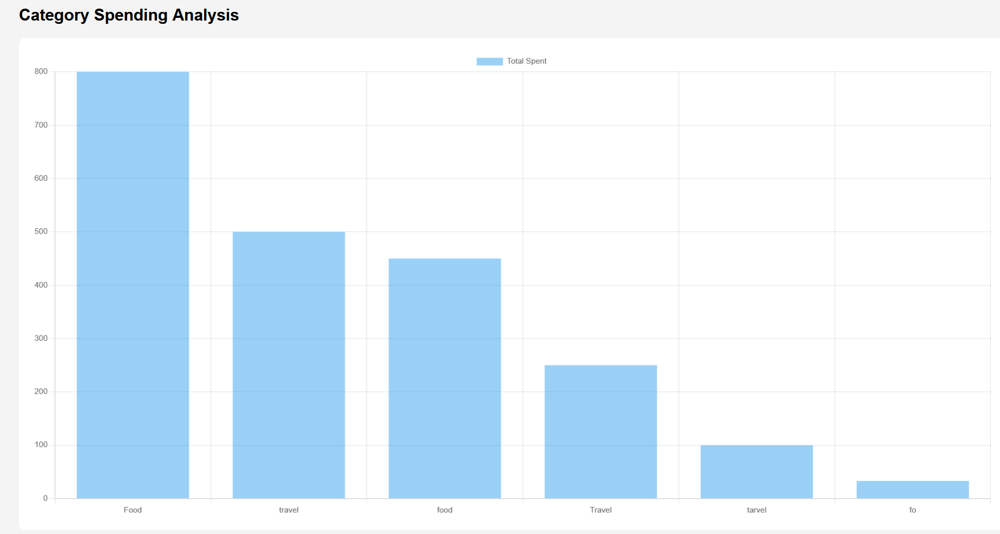
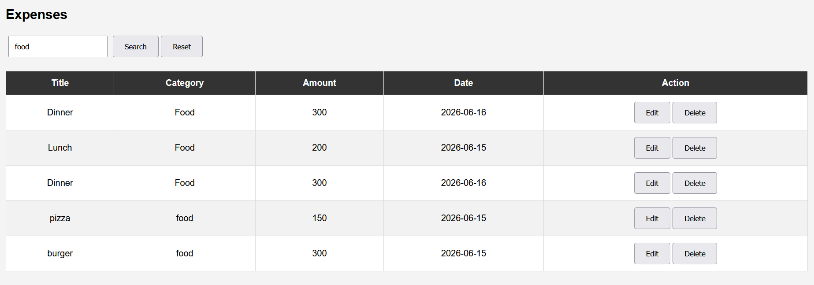
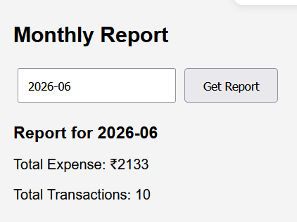
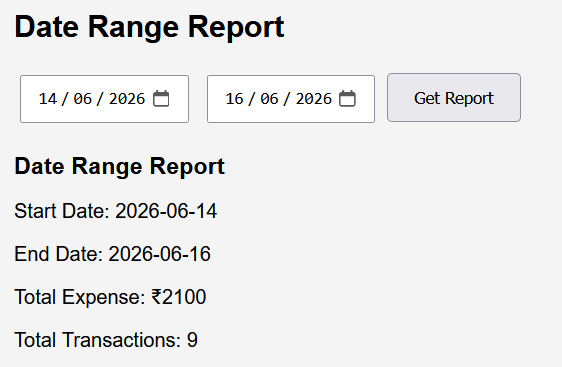

# Smart Expense Tracker

A full-stack Expense Tracking application built using **FastAPI**, **SQLAlchemy**, **SQLite**, **HTML**, **CSS**, **JavaScript**, and **Chart.js**.

The application helps users manage expenses and income, analyze spending patterns, generate reports, and visualize financial data through interactive charts.

---

## Features

### Expense Management

* Add expenses
* Edit expenses
* Delete expenses
* Search expenses
* View expense history

### Income Management

* Add income
* View income history

### Dashboard Analytics

* Total Income
* Total Expense
* Current Balance
* Top Spending Category

### Reports

* Monthly Expense Report
* Date Range Expense Report

### Data Visualization

* Category-wise spending chart using Chart.js

---

## Screenshots

### Dashboard



### Income History



### Expense History



### Expense Analytics



### Search Expenses



### Monthly Report



### Date Range Report



---

## Tech Stack

### Backend

* FastAPI
* SQLAlchemy
* SQLite

### Frontend

* HTML
* CSS
* JavaScript
* Chart.js

---

## Project Structure

```text
smart-expense-tracker/
│
├── app/
│   ├── main.py
│   ├── crud.py
│   ├── models.py
│   ├── schemas.py
│   └── database.py
│
├── templates/
│   └── index.html
│
├── static/
│   ├── script.js
│   └── style.css
│
├── screenshots/
│   ├── dashboard.png
│   ├── income-history.png
│   ├── expense-history.png
│   ├── chart.png
│   ├── search.png
│   ├── monthly-report.png
│   └── date-range-report.png
│
├── requirements.txt
├── .gitignore
└── README.md
```

---

## Installation

### Clone Repository

```bash
git clone <your-github-repository-url>
cd smart-expense-tracker
```

### Create Virtual Environment

```bash
python -m venv venv
```

### Activate Virtual Environment

Windows:

```bash
venv\Scripts\activate
```

### Install Dependencies

```bash
pip install -r requirements.txt
```

### Run Application

```bash
uvicorn app.main:app --reload
```

Open:

```text
http://127.0.0.1:8000
```

---

## API Endpoints

### Expenses

| Method | Endpoint                   |
| ------ | -------------------------- |
| POST   | /expenses                  |
| GET    | /expenses                  |
| PUT    | /expenses/{id}             |
| DELETE | /expenses/{id}             |
| GET    | /expenses/search/{keyword} |

### Income

| Method | Endpoint     |
| ------ | ------------ |
| POST   | /income      |
| GET    | /income      |
| PUT    | /income/{id} |
| DELETE | /income/{id} |

### Reports

| Method | Endpoint                               |
| ------ | -------------------------------------- |
| GET    | /reports/monthly/{month}               |
| GET    | /reports/range/{start_date}/{end_date} |

### Analytics

| Method | Endpoint                  |
| ------ | ------------------------- |
| GET    | /dashboard                |
| GET    | /analytics/top-categories |

---

## Future Improvements

* JWT Authentication
* User-specific expense tracking
* Export reports as PDF
* Budget planning and alerts
* Advanced analytics dashboard
* Dark mode support

---

## Author

**Lokesh Prasad**

Built as a learning project to explore FastAPI, SQLAlchemy, frontend integration, analytics, reporting, and full-stack development.
